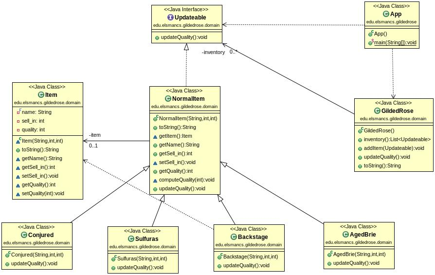

# GildedRoseKata

This kata is based in the TDD kata from Emily Bache [Emily Bache did](https://github.com/emilybache/GildedRose-Refactoring-Kata/tree/main/Java) to practise TDD (test-driven-development)and the one my teacher did to practise DDD (domain-driven-design). Kata of my teacher in [java](https://github.com/dfleta/gilded-rose-kata-java) / [python](https://github.com/dfleta/Python_ejercicios/tree/master/Poo/GildedRose_Refactoring_TDD_Kata)

To get familiar with the concepts of the DDD, we made a first meeting in class to decide the model and the class diagram that we would follow to create the software. The first step was to look at the [original requirements](./OriginalRequirements.txt) the kata is designed for to understand a little bit more what we had to do.

## Requirements

A quick resume of the problem we had to solve is the following one:

* There exist a magic shop called "GildedRose" in which magic items are sold. We had to program code to update each item bsaed on how each [quality behaviour](./qualityBehaviour.txt) works. Since we the shop was in expansion, we had to add a new category of item to the code they gave us to [refactor](https://github.com/emilybache/GildedRose-Refactoring-Kata/blob/main/python/gilded_rose.py) (since it is a little bit caos. SPOILER: ***a lot***)

## DDD

To start creating the model, we had to learn about the domain, the items that were located at the shop, how their propierties are calculated and a lot of different information we needed before we start writing some code.

After a few discussion we wrote a class diagram (UML) in which we already satisfied all the requierements.

## OOP-LSP

We also focused on OOP (object-oriented programing) so we learnt how inheritance, java's interfaces or polymorphism work.
